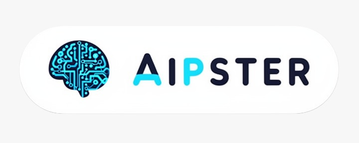

# Power of LLaMA — Code Companion

> Companion repository for the [**The Power of LLaMA**](https://aipster.com/tutorials/local-llms-why-this-niche-matters-and-how-to-start/) tutorial series on [AIpster](https://aipster.com).

## About the Series

[**The Power of LLaMA**](https://aipster.com/tutorials/local-llms-why-this-niche-matters-and-how-to-start/) is a tutorial series by [Bruno Sofiato](https://aipster.com/author/bruno-sofiato/) that walks you through the world of **local LLMs** — running large language models on your own hardware instead of relying on cloud APIs.

The series covers:
- **How LLMs work** — transformer architecture, inference engines, and your first local model
- **User interfaces** — from terminal to Open WebUI, plus tokens, embeddings, and multimodal models
- **Hallucinations & RAG** — why LLMs make things up and how retrieval-augmented generation reduces mistakes
- **Model selection** — parameter counts, MoE vs. dense architectures, and reasoning vs. instruct paradigms
- **Building with local LLMs** — writing your own harness, integrating search, and creating agentic workflows

Each part pairs theory with hands-on code so you can follow along on your own machine.

## Releases

| Part | Title | Release Date | Description |
|---|---|---|---|
| 1 | [The Brain, the Engine, and Your First Llama on Ollama](https://aipster.com/tutorials/the-power-of-llama-part1-the-brain-the-engine-and-your-first-llama-on-ollama/) | 2026-06-30 | Transformer architecture, inference engines, and setting up your first local LLM with Ollama. |
| 2 | [From Terminal to a ChatGPT-Style Chat](https://aipster.com/tutorials/open-webui-for-ollama-better-local-llm-interface/) | 2026-07-06 | Open WebUI setup, token theory, embeddings, and an introduction to multimodal models like Gemma 4. |
| 3 | [The Facts and the Reason](https://aipster.com/tutorials/how-to-stop-llm-hallucinations-with-rag-in-open-webui/) | 2026-07-13 | Why LLMs hallucinate, how RAG (Retrieval-Augmented Generation) provides context to reduce mistakes, and the reasoning behind model behavior. |
| 4 | [Does Size Really Matter?](https://aipster.com/tutorials/the-power-of-llama-part-4-does-size-really-matter/) | 2026-07-20 | Parameter counts, MoE vs. dense architectures, reasoning vs. instruct models, and how to choose the right model for your hardware. |
| 5 | Building a Naive Harness | **TBD** | Code companion — building a minimal OpenAI-compatible harness with SearXNG search delegation. |

## Artifacts

Code artifacts and projects built throughout the series.

| Artifact | Part | Description |
|---|---|---|
| [`naive-harness`](part-5/naive-harness/) | 5 | A minimal OpenAI-compatible harness with SearXNG search delegation. No LangChain, no frameworks — just raw API calls. Demonstrates how to build a stateless LLM agent that can delegate search queries to the model at runtime via `<search>...</search>` tags. |
| [`searxng`](part-5/searxng/) | 5 | Docker Compose setup for a local SearXNG instance — a privacy-respecting metasearch engine that aggregates results from dozens of search services. Required by `naive-harness` for web search delegation. |

## Directory Structure

```
power-of-llama/
├── README.md                     # This file — series overview and links
└── part-5/
    ├── naive-harness/            # Part 5 artifact — the naive harness
    └── searxng/                  # Part 5 artifact — SearXNG Docker setup
```

Future parts will add their own directories under `part-N/` as the series progresses.
