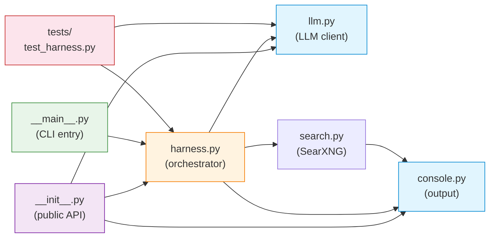

# Naive Harness

> ⚠️ **Educational Purpose Only** — This project is provided strictly for educational and demonstration purposes. It is not production-ready software. Use at your own risk.

A minimal OpenAI-compatible harness with **SearXNG search delegation**. No LangChain, no LangGraph — just raw API calls.

## Known Limitations

### Intentional Bug: History Is Always Lost

This harness has a **deliberate design limitation** — conversation history is never maintained between calls. Every invocation is completely stateless. This is intentional and serves as a teaching example to illustrate why state management is critical in conversational AI systems.

## The "Naive" Part

Each call to the model is **completely stateless**. No conversation history is maintained between invocations. Every call sends only:

1. The system prompt
2. The current user message (plus optional search results from a previous step)

## Dependencies

| Dependency | Version | Purpose |
|---|---|---|
| Python | ^3.11 | Runtime |
| openai | ^1.30.0 | OpenAI-compatible API client |
| httpx | ^0.27.0 | HTTP client for SearXNG requests |
| rich | ^13.7.0 | Colored console output |
| pytest | ^8.0.0 | Testing (dev dependency) |

## Features

- **No conversation history** — each LLM call is fresh
- **Search protocol** — model can request searches via `<search>...</search>` tags
- **SearXNG integration** — delegates search to any SearXNG instance
- **Colored console output** — thinking blocks are cyan, responses are green
- **OpenAI-compatible** — works with Ollama, vLLM, OpenAI, or any compatible API

## How to Run

### Prerequisites

- Python 3.11 or higher
- Poetry (for dependency management)
- A SearXNG instance running

### Quick Start

```bash
# Install dependencies
poetry install

# With Ollama running on port 11434 and SearXNG on port 8080:

```bash
python -m naive_harness \
  --api-key "ollama" \
  --api-url "http://localhost:11434/v1" \
  --searxng-url "http://localhost:8080" \
  --prompt "Who won the 2024 tennis Grand Slam?"
```

### Parameters

| Parameter | Required | Default | Description |
|---|---|---|---|
| `--api-key` | Yes | — | OpenAI-compatible API key |
| `--api-url` | No | `http://localhost:11434/v1` | API base URL |
| `--searxng-url` | Yes | — | SearXNG instance URL |
| `--prompt` | Yes | — | User query |
| `--model` | No | `gemma4:e2b` | Model name |
| `--system-prompt` | No | Built-in | Override system prompt |
| `--max-tokens` | No | `1024` | Max response tokens |

## Folder Structure

```
naive-harness/
├── README.md                 # This file
├── pyproject.toml            # Project metadata & dependencies (Poetry)
├── poetry.lock               # Locked dependency versions
├── naive_harness/            # Main package
│   ├── __init__.py           # Package init — exports public API
│   ├── __main__.py           # CLI entry point (python -m naive_harness)
│   ├── harness.py            # Core orchestration loop — stateless run()
│   ├── llm.py                # LLM client layer (OpenAI + Stub)
│   ├── search.py             # SearXNG search provider + HTML text extraction
│   └── console.py            # Colored console output handler
└── tests/
    ├── __init__.py           # Test package marker
    └── test_harness.py       # Unit tests for run(), patterns, prompts
```

- **`naive_harness/`** — The core Python package. Each module has a single responsibility (see [Main Classes](#main-classes-and-their-roles) below).
- **`tests/`** — Pytest unit tests that exercise the harness loop, search patterns, and stateless behavior.
- **`pyproject.toml` / `poetry.lock`** — Poetry-based dependency management.

## Main Modules and Their Roles

| Module | Role |
|---|---|
| `naive_harness/__init__.py` | **Package public API.** Re-exports the key classes and functions (`Console`, `run`, `DEFAULT_SYSTEM_PROMPT`, `LLMClient`, `LLMResponse`, `OpenAIClient`, `StubClient`) so consumers can import directly from `naive_harness`. |
| `naive_harness/__main__.py` | **CLI entry point.** Defines `main()` and parses command-line arguments via `argparse` (`--api-key`, `--api-url`, `--searxng-url`, `--prompt`, `--model`, `--system-prompt`, `--max-tokens`). Invokes `run()` with the resolved arguments. Enables `python -m naive_harness`. |
| `naive_harness/harness.py` | **Core orchestration.** Contains the `run()` function — the stateless loop that sends prompts to the LLM, detects `<search>...</search>` tags in responses, delegates to `SearchProvider` when found, and retries with search results appended. Also defines `DEFAULT_SYSTEM_PROMPT` and the regex patterns for the search protocol. |
| `naive_harness/llm.py` | **LLM client layer.** Defines the `LLMClient` protocol (interface), `LLMResponse` dataclass, `OpenAIClient` (wraps the OpenAI SDK for any compatible API), and `StubClient` (deterministic test double). Abstracts all LLM communication behind a single `complete()` method. |
| `naive_harness/search.py` | **Search provider.** Contains `SearchProvider` which queries a SearXNG instance, fetches full page content from result URLs, and returns formatted text. Includes `TextExtractor`, an HTML parser that strips scripts, styles, and navigation elements to produce clean text. Supports both single and batch queries. |
| `naive_harness/console.py` | **Console output.** Provides the `Console` class with color-coded terminal helpers (ANSI codes) — grey for reasoning/thinking blocks, blue for search activity, white for final responses. Exposed as a module-level `console` singleton. |
| `tests/test_harness.py` | **Unit tests.** Exercises the harness loop, search pattern matching, and stateless behavior. Uses `StubClient` to avoid real API calls. Tests cover: direct responses, search delegation, and verification that no message history accumulates. |

## Module Dependencies



**Arrow direction:** points **from** the importing module **to** the imported module. `console.py` and `llm.py` are leaf modules with no internal dependencies — everything else builds on top of them.


