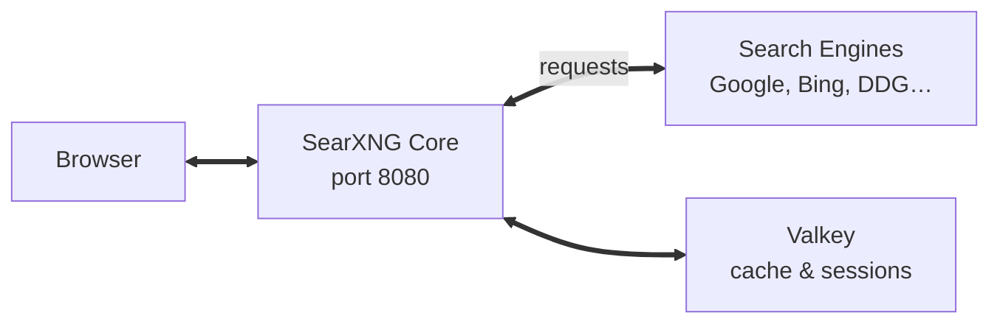

# SearXNG Docker Setup

A ready-to-run Docker Compose configuration for [SearXNG](https://github.com/searxng/searxng) — a free, privacy-respecting metasearch engine that aggregates results from dozens of search services without tracking users.

> **⚠️ Educational Purpose Only** — This setup is intended for local development and learning. It is not hardened for production deployment.

## Quick Start

```bash
# 1. Copy the environment file
cp .env.example .env

# 2. Start the services
docker compose up -d
```

SearXNG will be available at **http://localhost:8080**.

> **⚠️ Important:** Before first use, change `server.secret_key` in `core-config/settings.yml` from the default placeholder to a random string of at least 32 characters. This key is used for cryptographic signing of sessions and tokens — without changing it, your instance is vulnerable to session tampering.

To generate a secure key:

```bash
python3 -c "import secrets; print(secrets.token_hex(32))"
```

## Architecture



- **`searxng-core`** — The main SearXNG application (aggregates search results)
- **`searxng-valkey`** — In-memory cache for search results and session data

## Configuration

All configuration is done through two files:

### `.env` — Environment Variables

| Variable | Default | Description |
|---|---|---|
| `SEARXNG_VERSION` | `latest` | SearXNG Docker image version tag. Pin to a specific version (e.g. `2026.3.25-541c6c3cb`) for stability. |
| `SEARXNG_HOST` | `[::]` | Address to bind to. Set to `127.0.0.1` for localhost-only access, or `[::]` for all interfaces. |
| `SEARXNG_PORT` | `8080` | Port the web interface listens on. |

### `core-config/settings.yml` — SearXNG Settings

The settings file is mounted into the container at `/etc/searxng/`. Below are all parameters currently configured.

> **Note:** This file contains only a subset of SearXNG's configuration parameters. For the full list of available settings, see the [SearXNG settings documentation](https://docs.searxng.org/admin/settings/settings.html).

| Parameter | Value | Description |
|---|---|---|
| `use_default_settings` | `true` | Load default settings from SearXNG's built-in configuration and override only the keys specified here. |
| `server.secret_key` | `"{{CHANGE ME}}"` | Cryptographic key for signing sessions and tokens. **Must be changed to a random string of 32+ characters before use.** |
| `server.image_proxy` | `true` | Proxy images through SearXNG instead of linking directly. Uses server memory but protects user privacy by hiding the user's IP from image hosts. |
| `search.formats` | `["html", "json"]` | Result formats available via the API. `html` for the web interface, `json` for programmatic access. Remove formats to deny access. |
| `general.debug` | `false` | Interactive debugger and auto-reload. **Never enable in production.** |
| `general.enable_metrics` | `true` | Record anonymous metrics available at `/stats`. |
| `general.instance_name` | `"SearXNG"` | Display name shown in the UI footer. |
| `general.privacypolicy_url` | `false` | Link to a privacy policy page. Set to `false` to hide. |

## Search API

SearXNG exposes search results in multiple formats. With `formats: [html, json]` configured:

| Format | Usage |
|---|---|
| `html` | Web browser interface at `http://localhost:8080` |
| `json` | API endpoint: `http://localhost:8080/search?q=your+query&format=json` |

Example JSON request:

```bash
curl "http://localhost:8080/search?q=local+LLMs&format=json"
```

## Troubleshooting

| Problem | Solution |
|---|---|
| Port 8080 already in use | Change `SEARXNG_PORT` in `.env` and update the port mapping in `docker-compose.yml` |
| Search returns no results | Engines may be temporarily suspended. Check `/stats` for error counts. |
| "CAPTCHA" errors | Increase `suspended_times.cf_SearxEngineCaptcha` or reduce request frequency |

## Resources

- [SearXNG on GitHub](https://github.com/searxng/searxng)
- [SearXNG Documentation](https://docs.searxng.org/)
- [Settings Reference](https://docs.searxng.org/admin/settings/settings.html)
- [Installation Guide](https://docs.searxng.org/admin/installation-docker.html)
